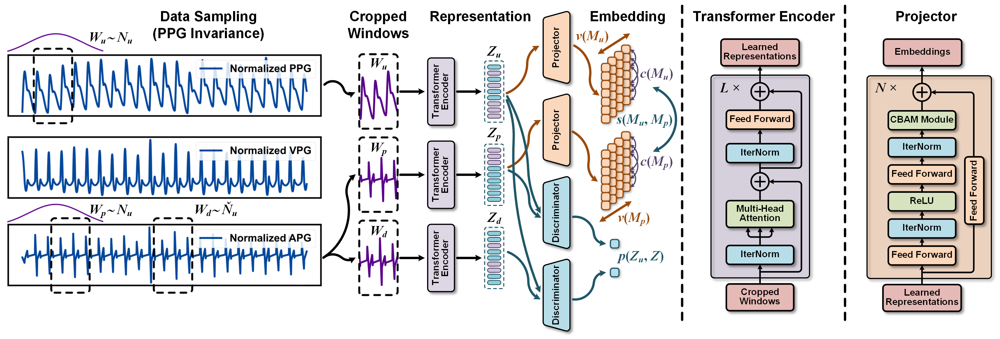

# UPR-BP: Unsupervised Photoplethysmography Representation Learning for Noninvasive Blood Pressure Estimation
#### *by: Chenbin Ma, Peng Zhang, Fan Song, Zeyu Liu, Youdan Feng, Yufang He, GuangLei Zhang*


## Supplementary Material and code for **UPR-BP**

<p align="center">

</p>

## Datasets
### Available Datasets
We used public Kaggle dataset and our collected private EALR dataset in this study.
- [Kaggle dataset](https://www.kaggle.com/datasets/mariaherrerot/eyepacspreprocess)  
- [EALR dataset]() 

## Implementation Code
### Requirmenets:
- Python3
- Pytorch==1.7
- Numpy==1.20.1
- scikit-learn==0.24.1
- Pandas==1.2.4
- skorch==0.10.0 (For DEV risk calculations)
- openpyxl==3.0.7 (for classification reports)
- Wandb=0.12.7 (for sweeps)

### Adding New Dataset
#### Structure of data
To add new dataset (*e.g.,* NewData), it should be placed in a folder named: NewData in the datasets directory.

Since "NewData" has several domains, each domain should be split into train/test splits with naming style as
"train_i_*x*.pt" and "test_i_*x*.pt" for each *i-th* fold.

The structure of data files should in dictionary form as follows:
`train.pt = {"samples": data, "labels: labels}`, and similarly for `test.pt`.

#### Configurations
Next, you have to add a class with the name NewData in the `configs/data_model_configs.py` file. 
You can find similar classes for existing datasets as guidelines. 
Also, you have to specify the cross-domain scenarios in `self.scenarios` variable.

Last, you have to add another class with the name NewData in the `configs/hparams.py` file to specify
the training parameters.


### Existing Algorithms
#### Vision Transformers
- [Vanilla ViT]()
- [Mobile ViT]()
- [EfficientFormer]()
- [CaiT]()
- [XCiT]()
- [BEiT]()
- [VOLO]()
- [SwinT]()
- [ConViT]()
#### CNNs
- [ResNet101]()
- [ResNeXt101]()
- [SEResNet101]()
- [ECAResNet101]()
- [MobileNetv3]()
- [BiT]()
- [Xception71]()
- [EfficientNetv2]()
- [ConvNeXt]()
- [DenseNet121]()


### Adding New Algorithm
To add a new algorithm, place it in `algorithms/algorithms.py` file.

## Training procedure

The experiments are organised in a hierarchical way such that:
- Several experiments are collected under one directory assigned by `--experiment_description`.
- Each experiment could have different trials, each is specified by `--run_description`.
- For example, if we want to experiment different *EALR Detection* methods with CNN backbone, we can assign
`--experiment_description CNN_backnones --run_description TDModel` and `--experiment_description CNN_backnones --run_description MIL-CT` and so on.

### Training a model

To train a model:

```
python main.py  --experiment_description exp1  \
                --run_description run_1 \
                --da_method DANN \
                --dataset Kaggle \
                --backbone CNN \
                --num_runs 5 \
                --is_sweep False
```
### Launching a sweep
Sweeps here are deployed on [Wandb](https://wandb.ai/), which makes it easier for visualization, following the training progress, organizing sweeps, and collecting results.

```
python main.py  --experiment_description exp1_sweep  \
                --run_description sweep_over_lr \
                --da_method ViT \
                --dataset EALR \
                --backbone CNN \
                --num_runs 200 \
                --is_sweep True \
                --num_sweeps 50 \
                --sweep_project_wandb TEST
```
Upon the run, you will find the running progress in the specified project page in wandb.

`Note:` If you got cuda out of memory error during testing, this is probably due to DEV risk calculations.

### Upper and Lower bounds
To obtain the source-only or the target-only results, you can run `same_domain_trainer.py` file.

## Results
- Each run will have all the cross-domain scenarios results in the format `src_to_trg_run_x`, where `x`
is the run_id (you can have multiple runs by assigning `--num_runs` arg). 
- Under each directory, you will find the classification report, a log file, checkpoint, 
and the different risks scores.
- By the end of the all the runs, you will find the overall average and std results in the run directory.


## Citation
If you found this work useful for you, please consider citing it.
```
@article{MIL-CT,
  title   = {UPR-BP: Unsupervised Photoplethysmography Representation Learning for Noninvasive Blood Pressure Estimation},
  author  = {Chenbin Ma, Peng Zhang, Fan Song, Zeyu Liu, Youdan Feng, Yufang He, GuangLei Zhang},
  journal = {####},
  year    = {2023}
}
```

## Contact
For any issues/questions regarding the paper or reproducing the results, please contact any of the following.   

Chenbin Ma:  *machenbin@buaa.edu.cn*

Guanglei Zhang:   *guangleizhang@buaa.edu.cn*   

Department of Biomedical Engineering, Beihang University, 
37 Xueyuan Road, Beijing, 100853
